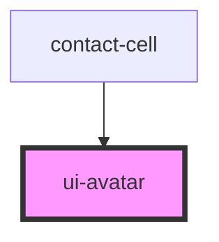

# ui-avatar

<!-- Auto Generated Below -->

## Properties

| Property   | Attribute  | Description | Type                                   | Default      |
| ---------- | ---------- | ----------- | -------------------------------------- | ------------ |
| `alt`      | `alt`      |             | `string`                               | `''`         |
| `fallback` | `fallback` |             | `"icon" \| "initials"`                 | `'initials'` |
| `initials` | `initials` |             | `string`                               | `undefined`  |
| `size`     | `size`     |             | `"lg" \| "md" \| "sm" \| "xl" \| "xs"` | `'md'`       |
| `src`      | `src`      |             | `string`                               | `undefined`  |

## Dependencies

### Used by

 - [contact-cell](../../molecules/contact-cell)

### Graph

----------------------------------------------

*Built with [StencilJS](https://stenciljs.com/)*
