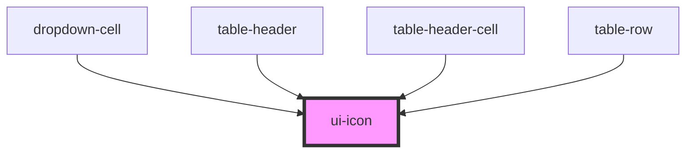

# ui-icon

<!-- Auto Generated Below -->

## Properties

| Property | Attribute | Description | Type                                                                                                                          | Default     |
| -------- | --------- | ----------- | ----------------------------------------------------------------------------------------------------------------------------- | ----------- |
| `color`  | `color`   |             | `string`                                                                                                                      | `undefined` |
| `name`   | `name`    |             | `"arrow-down" \| "arrow-up" \| "check" \| "chevron-down" \| "edit" \| "email" \| "eye" \| "more" \| "phone" \| "user" \| "x"` | `'user'`    |
| `size`   | `size`    |             | `"lg" \| "md" \| "sm" \| "xl" \| "xs"`                                                                                        | `'md'`      |

## Dependencies

### Used by

 - [dropdown-cell](../../molecules/dropdown-cell)
 - [table-header](../../organisms/table-header)
 - [table-header-cell](../../molecules/table-header-cell)
 - [table-row](../../organisms/table-row)

### Graph

----------------------------------------------

*Built with [StencilJS](https://stenciljs.com/)*
