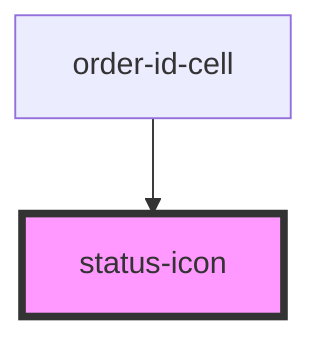

# status-icon

<!-- Auto Generated Below -->

## Properties

| Property | Attribute | Description | Type                                                                                      | Default     |
| -------- | --------- | ----------- | ----------------------------------------------------------------------------------------- | ----------- |
| `size`   | `size`    |             | `"lg" \| "md" \| "sm"`                                                                    | `'md'`      |
| `status` | `status`  |             | `"active" \| "closed" \| "critical" \| "neutral" \| "pending" \| "positive" \| "warning"` | `'pending'` |

## Dependencies

### Used by

 - [order-id-cell](../../molecules/order-id-cell)

### Graph

----------------------------------------------

*Built with [StencilJS](https://stenciljs.com/)*
