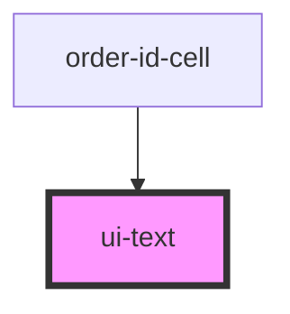

# ui-text

<!-- Auto Generated Below -->

## Properties

| Property   | Attribute  | Description | Type                                                                      | Default     |
| ---------- | ---------- | ----------- | ------------------------------------------------------------------------- | ----------- |
| `color`    | `color`    |             | `"error" \| "link" \| "primary" \| "secondary" \| "success" \| "warning"` | `undefined` |
| `truncate` | `truncate` |             | `boolean`                                                                 | `false`     |
| `variant`  | `variant`  |             | `"body" \| "caption" \| "h1" \| "h2" \| "h3" \| "link"`                   | `'body'`    |
| `weight`   | `weight`   |             | `"bold" \| "medium" \| "normal" \| "semibold"`                            | `undefined` |

## Dependencies

### Used by

 - [order-id-cell](../../molecules/order-id-cell)

### Graph

----------------------------------------------

*Built with [StencilJS](https://stenciljs.com/)*
