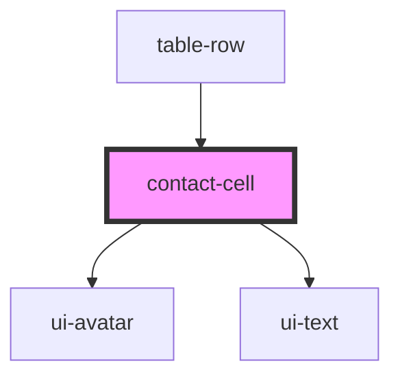

# contact-cell

<!-- Auto Generated Below -->

## Properties

| Property     | Attribute     | Description | Type      | Default     |
| ------------ | ------------- | ----------- | --------- | ----------- |
| `avatar`     | `avatar`      |             | `string`  | `undefined` |
| `name`       | `name`        |             | `string`  | `''`        |
| `showAvatar` | `show-avatar` |             | `boolean` | `true`      |

## Events

| Event          | Description | Type                  |
| -------------- | ----------- | --------------------- |
| `contactClick` |             | `CustomEvent<string>` |

## Dependencies

### Used by

 - [table-row](../../organisms/table-row)

### Depends on

- [ui-avatar](../../atoms/avatar)
- [ui-text](../../atoms/text)

### Graph

----------------------------------------------

*Built with [StencilJS](https://stenciljs.com/)*
