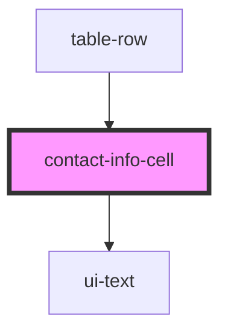

# contact-info-cell

<!-- Auto Generated Below -->

## Properties

| Property    | Attribute   | Description | Type                           | Default  |
| ----------- | ----------- | ----------- | ------------------------------ | -------- |
| `clickable` | `clickable` |             | `boolean`                      | `false`  |
| `type`      | `type`      |             | `"email" \| "phone" \| "text"` | `'text'` |
| `value`     | `value`     |             | `string`                       | `''`     |

## Events

| Event       | Description | Type                                            |
| ----------- | ----------- | ----------------------------------------------- |
| `infoClick` |             | `CustomEvent<{ type: string; value: string; }>` |

## Dependencies

### Used by

 - [table-row](../../organisms/table-row)

### Depends on

- [ui-text](../../atoms/text)

### Graph

----------------------------------------------

*Built with [StencilJS](https://stenciljs.com/)*
