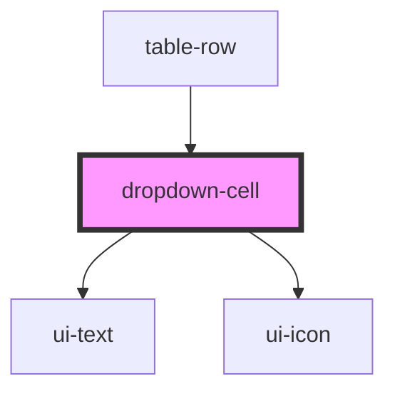

# dropdown-cell

<!-- Auto Generated Below -->

## Properties

| Property      | Attribute     | Description | Type               | Default       |
| ------------- | ------------- | ----------- | ------------------ | ------------- |
| `disabled`    | `disabled`    |             | `boolean`          | `false`       |
| `options`     | `options`     |             | `DropdownOption[]` | `[]`          |
| `placeholder` | `placeholder` |             | `string`           | `'Select...'` |
| `value`       | `value`       |             | `string`           | `''`          |

## Events

| Event            | Description | Type                  |
| ---------------- | ----------- | --------------------- |
| `dropdownChange` |             | `CustomEvent<string>` |

## Dependencies

### Used by

 - [table-row](../../organisms/table-row)

### Depends on

- [ui-text](../../atoms/text)
- [ui-icon](../../atoms/icon)

### Graph

----------------------------------------------

*Built with [StencilJS](https://stenciljs.com/)*
