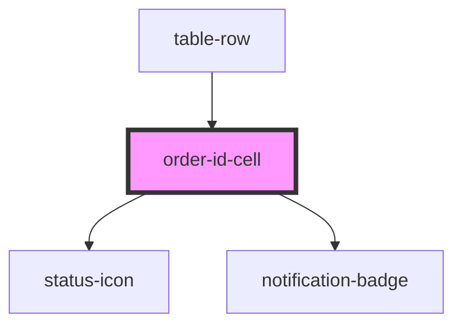

# order-id-cell

<!-- Auto Generated Below -->

## Properties

| Property            | Attribute            | Description | Type                          | Default     |
| ------------------- | -------------------- | ----------- | ----------------------------- | ----------- |
| `date`              | `date`               |             | `string`                      | `''`        |
| `notificationCount` | `notification-count` |             | `number`                      | `undefined` |
| `orderId`           | `order-id`           |             | `string`                      | `''`        |
| `status`            | `status`             |             | `"closed" \| "new" \| "open"` | `'open'`    |
| `time`              | `time`               |             | `string`                      | `''`        |

## Events

| Event        | Description | Type                  |
| ------------ | ----------- | --------------------- |
| `orderClick` |             | `CustomEvent<string>` |

## Dependencies

### Used by

 - [table-row](../../organisms/table-row)

### Depends on

- [status-icon](../../atoms/status-icon)
- [notification-badge](../../atoms/notification-badge)

### Graph

----------------------------------------------

*Built with [StencilJS](https://stenciljs.com/)*
