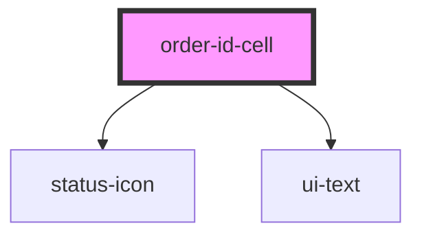

# order-id-cell

<!-- Auto Generated Below -->

## Properties

| Property  | Attribute  | Description | Type                          | Default     |
| --------- | ---------- | ----------- | ----------------------------- | ----------- |
| `date`    | `date`     |             | `string`                      | `''`        |
| `onClick` | `on-click` |             | `(orderId: string) => void`   | `undefined` |
| `orderId` | `order-id` |             | `string`                      | `''`        |
| `status`  | `status`   |             | `"closed" \| "new" \| "open"` | `'open'`    |
| `time`    | `time`     |             | `string`                      | `''`        |

## Dependencies

### Depends on

- [status-icon](../../atoms/status-icon)
- [ui-text](../../atoms/text)

### Graph

----------------------------------------------

*Built with [StencilJS](https://stenciljs.com/)*
