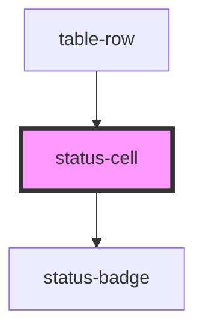

# status-cell

<!-- Auto Generated Below -->

## Properties

| Property  | Attribute | Description | Type                                                                                                                   | Default  |
| --------- | --------- | ----------- | ---------------------------------------------------------------------------------------------------------------------- | -------- |
| `status`  | `status`  |             | `string`                                                                                                               | `''`     |
| `variant` | `variant` |             | `"closed" \| "complete" \| "confirmed" \| "draft" \| "new" \| "none" \| "published" \| "review" \| "sent" \| "viewed"` | `'none'` |

## Dependencies

### Used by

 - [table-row](../../organisms/table-row)

### Depends on

- [status-badge](../../atoms/status-badge)

### Graph

----------------------------------------------

*Built with [StencilJS](https://stenciljs.com/)*
