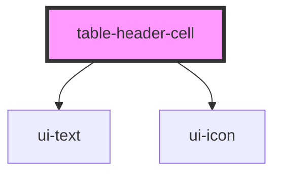

# table-header-cell

<!-- Auto Generated Below -->

## Properties

| Property        | Attribute        | Description | Type                            | Default     |
| --------------- | ---------------- | ----------- | ------------------------------- | ----------- |
| `align`         | `align`          |             | `"center" \| "left" \| "right"` | `'left'`    |
| `sortDirection` | `sort-direction` |             | `"asc" \| "desc"`               | `null`      |
| `sortable`      | `sortable`       |             | `boolean`                       | `false`     |
| `width`         | `width`          |             | `number \| string`              | `undefined` |

## Events

| Event       | Description | Type                |
| ----------- | ----------- | ------------------- |
| `sortClick` |             | `CustomEvent<void>` |

## Dependencies

### Depends on

- [ui-text](../../atoms/text)
- [ui-icon](../../atoms/icon)

### Graph

----------------------------------------------

*Built with [StencilJS](https://stenciljs.com/)*
