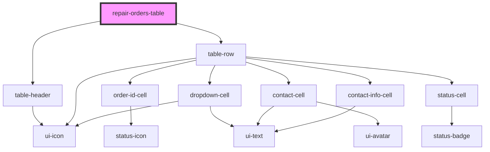

# repair-orders-table

<!-- Auto Generated Below -->

## Properties

| Property        | Attribute        | Description | Type                | Default |
| --------------- | ---------------- | ----------- | ------------------- | ------- |
| `data`          | `data`           |             | `RepairOrderData[]` | `[]`    |
| `loading`       | `loading`        |             | `boolean`           | `false` |
| `sortColumn`    | `sort-column`    |             | `string`            | `''`    |
| `sortDirection` | `sort-direction` |             | `"asc" \| "desc"`   | `null`  |

## Events

| Event        | Description | Type                                                                    |
| ------------ | ----------- | ----------------------------------------------------------------------- |
| `cellClick`  |             | `CustomEvent<{ cellType: string; value: any; data: RepairOrderData; }>` |
| `rowClick`   |             | `CustomEvent<RepairOrderData>`                                          |
| `sortChange` |             | `CustomEvent<{ column: string; direction: "asc" \| "desc"; }>`          |

## Dependencies

### Depends on

- [table-header](../table-header)
- [table-row](../table-row)

### Graph

----------------------------------------------

*Built with [StencilJS](https://stenciljs.com/)*
