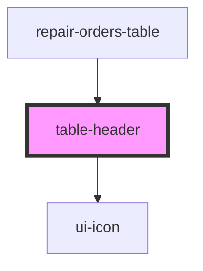

# table-header

<!-- Auto Generated Below -->

## Properties

| Property        | Attribute        | Description | Type              | Default |
| --------------- | ---------------- | ----------- | ----------------- | ------- |
| `columns`       | `columns`        |             | `TableColumn[]`   | `[]`    |
| `sortColumn`    | `sort-column`    |             | `string`          | `''`    |
| `sortDirection` | `sort-direction` |             | `"asc" \| "desc"` | `null`  |

## Events

| Event        | Description | Type                                                           |
| ------------ | ----------- | -------------------------------------------------------------- |
| `sortChange` |             | `CustomEvent<{ column: string; direction: "asc" \| "desc"; }>` |

## Dependencies

### Used by

 - [repair-orders-table](../repair-orders-table)

### Depends on

- [ui-icon](../../atoms/icon)

### Graph

----------------------------------------------

*Built with [StencilJS](https://stenciljs.com/)*
