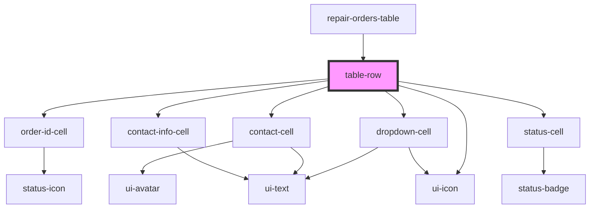

# table-row

<!-- Auto Generated Below -->

## Properties

| Property            | Attribute    | Description | Type              | Default     |
| ------------------- | ------------ | ----------- | ----------------- | ----------- |
| `data` _(required)_ | `data`       |             | `RepairOrderData` | `undefined` |
| `selectable`        | `selectable` |             | `boolean`         | `false`     |
| `selected`          | `selected`   |             | `boolean`         | `false`     |

## Events

| Event                  | Description | Type                                                                    |
| ---------------------- | ----------- | ----------------------------------------------------------------------- |
| `cellClick`            |             | `CustomEvent<{ cellType: string; value: any; data: RepairOrderData; }>` |
| `rowClick`             |             | `CustomEvent<RepairOrderData>`                                          |
| `serviceAdvisorChange` |             | `CustomEvent<{ orderId: string; value: string; }>`                      |
| `technicianChange`     |             | `CustomEvent<{ orderId: string; value: string; }>`                      |

## Dependencies

### Used by

 - [repair-orders-table](../repair-orders-table)

### Depends on

- [order-id-cell](../../molecules/order-id-cell)
- [dropdown-cell](../../molecules/dropdown-cell)
- [contact-cell](../../molecules/contact-cell)
- [contact-info-cell](../../molecules/contact-info-cell)
- [status-cell](../../molecules/status-cell)
- [ui-icon](../../atoms/icon)

### Graph

----------------------------------------------

*Built with [StencilJS](https://stenciljs.com/)*
